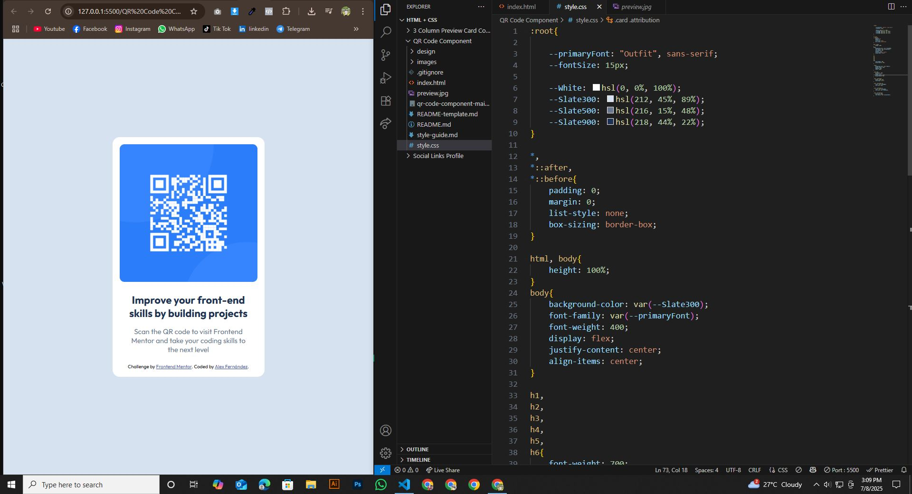

# Frontend Mentor - QR Code Component Challenge

This is a solution to the [QR Code Component Challenge](https://www.frontendmentor.io/challenges/qr-code-component-iux_sIO_H) on [Frontend Mentor](https://www.frontendmentor.io/challenges/qr-code-component-iux_sIO_H). Frontend Mentor challenges help you improve your coding skills by building realistic projects.

## Table of contents

- [Overview](#overview)
  - [Screenshot](#screenshot)
  - [Project Links](#links)
- [My Process](#my-process)
  - [Built with](#built-with)
  - [What I learned](#what-i-learned)
  - [Continued development](#continued-development)
  - [Useful resources](#useful-resources)
- [Author](#author)
- [Acknowledgments](#acknowledgments)


## Overview

### Screenshot





### Projects Links

- Solution URL: (https://github.com/hemal6325/QR-Code-Component-Challenge)
- Live Site URL: (https://hemal6325.github.io/QR-Code-Component-Challenge)

## My Process
I built this project using HTML and CSS, focusing on layout design and responsive styling. Through it, I learned Flexbox, Semantic Markup, and how to create visually balanced components.

### Built With

- HTML5 Semantic Structure
- CSS3 Custom Properties
- Flexbox


### What I Learned

During this experience, I gained valuable skills and deeper understanding of the subject. It helped me improve my problem-solving abilities and boosted my confidence in applying new concepts.


```css
:root{
    
    --primaryFont: "Outfit", sans-serif;
    --fontSize: 15px;

    --White: hsl(0, 0%, 100%);
    --Slate300: hsl(212, 45%, 89%);
    --Slate500: hsl(216, 15%, 48%);
    --Slate900: hsl(218, 44%, 22%);
}

*,
*::after,
*::before{
    padding: 0;
    margin: 0;
    list-style: none;
    box-sizing: border-box;
}

html, body{
    height: 100%;
}
body{
    background-color: var(--Slate300);
    font-family: var(--primaryFont);
    font-weight: 400;
    display: flex;
    justify-content: center;
    align-items: center;
}

h1,
h2,
h3,
h4,
h5,
h6{
    font-weight: 700;
    margin-bottom: 15px;
}

.card{
    background-color: var(--White);
    border-radius: 15px;
    padding: 15px;
    width: 320px;
}

.card img{
    max-width: 100%;
    height: auto;
    border-radius: 10px;
    margin-bottom: 0px;
}

.card .card-body{
    margin: 20px 15px;
    text-align: center;
}

.card .card-body h4{
    color: var(--Slate900);
    font-size: 22px;
}

.card .card-body p{
    color: var(--Slate500);
    font-size: var(--fontSize);
}

.card .attribution{
    font-size: 10px;
    font-family: var(--primaryFont);
}

```

### Continued Development

I would like to make my own QR Generator so this could be used as a default template.

The qr code could be links to a document or something along those ways. Going to think about something useful that could come in handy.

### Useful Resources

- [FLEXBOX FROGGY](https://flexboxfroggy.com/#es) - This helped me to understand better how to use flexbox.


## Author

- Frontend Mentor - [@hemal6325](https://www.frontendmentor.io/profile/hemal6325)
- GitHub Profile - [@hemal6325](https://github.com/hemal6325/)

## Acknowledgments


At some point i was a little stuck with setting the style for the image. And i found this video helpful.

(https://youtu.be/UBI4CLoAres?si=eTldObVGXUh5BvSi)


**Have Fun Building!** 🚀
